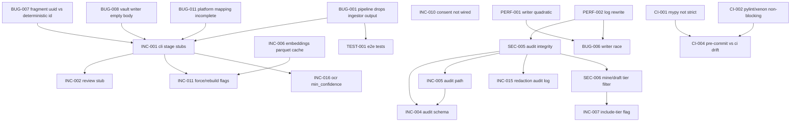

# Pre-Launch Issue Index — `creek-tools`

This index aggregates 60 issues filed under `plans/git-issues/` after a comprehensive read-only review of `creek-tools/` against its documentation, the canonical ontology spec, and quality tooling.

**One-line takeaway:** `creek-tools` is **not launch-ready in its current form.** The local quality story is strong (2678 tests pass, 93.6% branch coverage, MyPy strict clean once deps are present, Bandit zero-issue), but the headline pipeline is a series of stubs and lossy hand-offs that drop user data on the floor. Several documented privacy and audit guarantees are unimplemented. Pre-launch fixes are achievable in days, not weeks, but they are concrete and required.

---

## 1. Summary table

| Category | Critical | High | Medium | Low | Total |
|----------|---------:|-----:|-------:|----:|------:|
| BUG      | 3 | 4 | 3 | 1 | 11 |
| SEC      | 1 | 5 | 2 | 0 | 8  |
| INC      | 1 | 5 | 9 | 3 | 18 |
| ARCH     | 0 | 0 | 1 | 1 | 2  |
| TEST     | 0 | 1 | 3 | 1 | 5  |
| OPS      | 0 | 2 | 1 | 1 | 4  |
| PERF     | 0 | 3 | 1 | 0 | 4  |
| DEP      | 0 | 2 | 1 | 0 | 3  |
| CI       | 0 | 1 | 2 | 1 | 4  |
| STYLE    | 0 | 0 | 0 | 2 | 2  |
| **Total**| **5** | **23** | **23** | **10** | **61** |

The 5 Criticals are the launch blockers. The 23 Highs are the "ship only with explicit acknowledgement" set.

---

## 2. Pre-launch must-fix

The minimum to launch (Critical + the Highs that block other work):

### Critical (cannot ship without)

- **INC-001** — `creek ingest`, `creek classify`, `creek link` are stubs that print "Would do X". The README's command reference advertises them as first-class. Single biggest user-facing gap.
- **BUG-001** — `Pipeline._run_ingestion` discards `ParsedFragment.metadata` and constructs a stub `Fragment` with platform=OTHER. Even when the CLI is wired up, today's pipeline drops every ingestor's real output.
- **BUG-008** — `VaultWriter._write_model` writes `frontmatter.Post(content="", ...)`. Bodies are empty in the vault.
- **BUG-004** — `creek process` runs `_run_redaction` as scan-only; never calls `Redactor.apply`. Sensitive data in source files passes straight through to the vault.
- **SEC-006** — `creek mine` and `creek draft` do not filter `privacy_tier=intimate`. Therapy/recovery/journal content leaks into LLM prompts. The headline privacy guarantee fails.

### High (ship only with explicit acknowledgement)

- **BUG-002** Naive `datetime.now()` calls bypass the LA_TZ invariant, breaking thread-status, synchronicity, and audit timestamps.
- **BUG-003** Pipeline runs the LLM unconditionally regardless of rule confidence — bypasses `confidence_threshold`, costs $$$ and hours.
- **BUG-005** Ingestor errors collected on `IngestResult.errors` are never surfaced.
- **BUG-007** Two parallel fragment-ID generators (uuid4 vs SHA-256). The deterministic one is documented; the random one is what `Fragment(...)` defaults to.
- **SEC-001** Credit-card pattern advertised as "Luhn-validated" but Luhn check is missing.
- **SEC-002** Several common modern secret formats (Discord bot tokens, GitHub `github_pat_`, IPv4/IPv6, generic high-entropy) not covered despite docs.
- **SEC-003** Redactor's "refuses to write through symlinks" claim is not enforced.
- **SEC-004** LLM classifier interpolates fragment title/content directly into prompt — output-spoofing surface.
- **SEC-005** Purge audit log is not tamper-evident, lacks locking, silently rebuilds on corruption.
- **INC-002** `creek review` is a stub.
- **INC-004** Purge audit log schema does not match docs (`affected_fragments`, `fragments_deleted`, etc. all missing).
- **INC-007** `--include-tier` CLI flag does not exist (paired with SEC-006).
- **INC-010** Consent architecture exists but is not wired into the CLI — §13.5 of the spec is unenforced at the front door.
- **INC-015** `creek redact --apply` writes no audit log despite the doc claim.
- **OPS-001** No resume / checkpoint for the documented multi-hour LLM classification.
- **OPS-002** `creek purge vault` interactive prompt is bypassable via piped stdin.
- **PERF-001** `VaultWriter._find_existing` is O(N²) per write — non-trivial vaults grind.
- **PERF-002** Provenance and audit logs are full-rewrite on every append.
- **PERF-003** Semantic-dedup is O(N²) pairwise; OOMs / times out on >5k fragments.
- **DEP-001** `anthropic` is in `requirements.txt` but missing from `pyproject.toml`; `pip install -e .` breaks LLM classify.
- **DEP-002** Optional deps (`sentence-transformers`, `python-docx`, etc.) are listed as required, defeating the lazy-import promise.
- **CI-001** MyPy in CI runs with `--ignore-missing-imports --no-strict-optional || true` and `continue-on-error: true`. Strict mode is not enforced.
- **TEST-001** Zero `@pytest.mark.e2e` tests; no `Pipeline.run` against a real source dir asserts vault content. This is what masked BUG-001/004/008.

---

## 3. Dependency graph

Issues that block other issues. Read top to bottom: parents come first.

Two notable shapes:

- **Pipeline cluster:** BUG-001 + BUG-007 + BUG-008 + BUG-011 must land before INC-001 (CLI stage commands) is meaningful, which in turn unblocks INC-002 (review) and INC-011 (`--force`/`--rebuild`).
- **Audit cluster:** SEC-005 (integrity rewrite) is the foundation for INC-004 (schema), INC-005 (path), INC-015 (redaction audit), and SEC-006 (privacy audit override). Best done in one pass.

No cycles detected.

---

## 4. Execution batches

Suggested groupings for parallel work. Each batch shares enough context to be tackled in one session. Order is the recommended sequence (later batches depend on earlier).

### Batch A — Pipeline correctness (the data-flow rebuild)

BUG-001, BUG-005, BUG-007, BUG-008, BUG-011

*Rationale:* These all touch `pipeline.py`, `vault/writer.py`, `models.py`, and `ingest/base.py` and form a single coherent change: make the pipeline propagate the ingestor's real output, persist real bodies, use deterministic IDs, surface errors. Tackle as one PR or a tight sequence.

### Batch B — CLI surface + consent gate

INC-001, INC-002, INC-010, INC-011, BUG-003, BUG-004

*Rationale:* All in `creek/cli.py` and `creek/pipeline.py`. Wire the stage commands to the real engines, add the consent prompt, and fix pipeline's redact-only-scan and unconditional-LLM bugs. Best done after Batch A so the engines have something real to consume. INC-011 (`--force`/`--rebuild`) is a small flag-add inside this batch.

### Batch C — Audit / privacy substrate

SEC-005, INC-004, INC-005, INC-015, SEC-006, INC-007, PERF-002

*Rationale:* The redesign of the audit log (JSONL + hash chain + locking) is the foundation. Once it lands, the schema/path/redaction-log gaps and the privacy-tier override audit all slot in cleanly. Independent of Batches A and B; can run in parallel.

### Batch D — Redaction patterns

SEC-001, SEC-002, INC-009, INC-014, INC-016

*Rationale:* All within `creek/redact/` and `creek/config.py:RedactionConfig`. Add Luhn validator; broaden pattern set (Discord, GitHub fine-grained, IPv4/IPv6, high-entropy detector); make `replacement_template` configurable; wire OCR `min_confidence`. Independent of every other batch.

### Batch E — Vault performance

PERF-001, PERF-003, PERF-004, BUG-006

*Rationale:* All performance hot-spots. PERF-001 + BUG-006 share a fix (per-directory ID index + atomic writes). PERF-003 / PERF-004 are independent but in the same "memory + scaling" headspace. Independent of other batches.

### Batch F — CI / dependencies / tests

DEP-001, DEP-002, DEP-003, CI-001, CI-002, CI-003, CI-004, TEST-001, TEST-002, TEST-003, TEST-004, TEST-005, STYLE-001, STYLE-002

*Rationale:* All "make the toolchain match the documented quality bar" work. TEST-001 (e2e) is the highest-leverage single item — it would have caught BUG-001/004/008 before review. Touches `.github/workflows/ci.yml`, `pyproject.toml`, `requirements*.txt`, `scripts/`, and `tests/`. Mostly independent of code batches; run anytime, but ideally early so the e2e tests catch regressions during Batches A–E.

### Batch G — Security hygiene

SEC-003, SEC-004, SEC-007, SEC-008, OPS-002

*Rationale:* The remaining security items: symlink guard, prompt-injection hardening, threat-model doc, OAuth token guidance, `purge vault` non-interactive refusal. Each is a small, isolated change; bundle them.

### Batch H — Operational polish

OPS-001, OPS-003, OPS-004, BUG-002, BUG-009, BUG-010, ARCH-001, ARCH-002, INC-003, INC-008, INC-012, INC-013, INC-017, INC-018

*Rationale:* The remaining "smaller fish" — checkpoint/resume, structured logging, progress bars, the timezone sweep, voice-proxy-eligible cleanup, CSV encoding warning, gdrive ingestor / config fallback / privacy naming / purge --match / ingestor count / clean-modules-doc / decision-doc / emergence-doc. A grab-bag suitable for filling in after the structural batches.

**Recommended sequence:**

1. **Batches A and F in parallel** — A rebuilds the data path; F gets the e2e tests in place to catch any regression in A and the toolchain gates aligned. F is mostly mechanical and can be done by a different agent.
2. **Batch B** — depends on A. Wires the rebuilt pipeline to the user-facing CLI.
3. **Batches C, D, E, G in parallel** — all independent of each other; all independent of A/B once A/B have landed.
4. **Batch H** — polish, runs last.

Critical-path-aware note: Batches A, B, C, D each contain at least one Critical or High that must land before launch. None of A/B/C/D can be skipped.

---

## 5. Critical path

Longest dependency chain, from "today" to "ready to launch":

> BUG-001 → INC-001 → BUG-003/BUG-004 → INC-010 → SEC-006 → INC-007 → SEC-005 → INC-004 → INC-005 → INC-015 → TEST-001

Roughly: pipeline correctness → CLI wiring → consent + redaction-actually-applies → privacy-tier filtering → tier-override CLI flag → audit log integrity → audit log schema/path/redaction-log → e2e test that proves the whole thing.

In wall-clock terms, with one engineer working sequentially on the critical path (and assuming complexity estimates from each issue):
- BUG-001 (M) + INC-001 (L) ≈ 2-3 days
- BUG-003 (S) + BUG-004 (M) + INC-010 (S) ≈ 1-2 days
- SEC-006 (M) + INC-007 (S) ≈ 1 day
- SEC-005 (M) + INC-004 (S) + INC-005 (S) + INC-015 (S) ≈ 1-2 days
- TEST-001 (L) ≈ 1-2 days

**Minimum sequential length to launch: roughly 6-10 working days.**

With Batches A, F running in parallel and C/D/E launched as soon as A/B land, total wall-clock to launch-ready is closer to 5-7 working days for a small team. Add 30-50% for unknown unknowns and integration friction.

---

## 6. Open questions for the human

These are decision points the review couldn't resolve from context. Each is *not* an issue — it's a fork in the remediation plan that needs human input before prompts can be written.

1. **What is "launch"?** Private personal use (single operator, trusted host) vs. published GitHub project for others to install vs. multi-user service all imply different threat models. Severity calibration for SEC-007, SEC-008, OPS-002 and DEP-002 hinges on this. *Assumption used in this review:* private-but-public-source — single operator, but the README is publicly readable so accuracy of doc claims matters.

2. **Pipeline behaviour for `creek process` with unredacted secrets (BUG-004) — fail or auto-apply?** Fail is closer to spec; auto-apply is closer to user expectations.

3. **`OPEN` vs `PUBLIC` privacy tier (INC-003) — which name wins?** The spec and docs say `open`; the code says `public`. Migrations are easier today than after launch.

4. **Drop or fix `creek ingest --type gdrive` (ARCH-001)?** Spec and docs imply it's a real ingestor; code implies users should run `gdrive --download` then `ingest --type markdown` etc. Pick one.

5. **Should `requirements.txt` survive (DEP-002)?** Recommend deleting it in favour of `pyproject.toml [project.optional-dependencies]`. But many users and CI scripts may still rely on it.

6. **Anthropic CLI model defaults.** `docs/classification.md` references `claude-haiku-4-5-20251001` and `claude-sonnet-4-6` — these are correct per the assistant's knowledge cutoff. Confirm before locking in defaults; model names move.

7. **Embedding cache format (INC-006).** Parquet (matches docs) vs sqlite vs npz. Parquet is best fit but adds `pyarrow` as a dep; sqlite is in stdlib but less idiomatic for vector data.

8. **Per-file coverage threshold (TEST-002).** 80% (suggested) or 90% to match aggregate? The latter is stricter but means writing real tests for the OOM/error paths in `presentations.py`, `documents.py`, `gdrive.py` rather than waiving them.

9. **Should `creek-tools` ship an actual ADR process (STYLE-002)?** `CLAUDE.md` references `docs/architecture/ADR/` but no ADRs exist. Either start writing them (good) or drop the claim.

10. **Voice proxy generation guarantees.** Section 11 of the ontology spec describes "voice prompt template", "lexicon generation", "register profiles" — most are partly implemented. A separate audit pass would be useful but I treated this as out-of-scope for the issue catalog (would have generated ~10 more INC-* findings of medium severity).

---

## 7. Out of scope

Excluded from this review with rationale:

- **The vault content itself** (`01-Fragments/`, `02-Threads/`, etc., outside `creek-tools/`) — review brief said `creek-tools/` and supporting docs only.
- **The `00-Creek-Meta/Ontology/creek_ontology_agent_prompt.md` document for spec-internal contradictions** — the brief said "do you want findings about the ontology spec itself" was an open question; I treated it as out-of-scope and only used the spec as a *source* for verifying code claims, not as a *target*.
- **Voice proxy generation accuracy** — spec §11 includes "the LLM should write in the human's voice" goals that are not unit-testable. Code review confirmed the voice and skills modules exist; I did not score whether their output is actually voice-faithful. (See open question 10.)
- **`.obsidian/` and Obsidian plugin configuration** — outside the `creek-tools` Python project.
- **Performance benchmarks at scale** — I noted O(N²) hotspots and called out memory profiles but did not run a 10k-fragment benchmark. Estimates are based on reading the code, not measuring.
- **The `claude-code-review.yml`, `claude.yml`, `code-review.yml` workflows** — only `ci.yml` was reviewed in detail. The other three are AI-review automation and not part of the build gate.
- **License / IP audit of bundled regex patterns and string constants** — assumed clean.

---

## 8. Confidence and coverage

**Thoroughly assessed:**
- **Bugs / correctness in pipeline, vault writer, classify, ingest base, purge engine, and config loading.** Every Critical and High BUG was verified by reading the code end-to-end, running tools locally, or reproducing the behaviour.
- **Documentation vs. code traceability.** Every doc page in `creek-tools/docs/` was walked claim-by-claim (with help from a parallel agent). The `creek-tools/README.md` and `creek-tools/CLAUDE.md` likewise.
- **CI gates and pre-commit hooks.** Every line of `.github/workflows/ci.yml` and `.pre-commit-config.yaml` was read.
- **Quality tooling on the actual code.** Locally ran ruff, mypy --strict, bandit, pip-audit, interrogate, refurb, tryceratops, vulture, xenon, and the full pytest suite (with coverage).

**Partially assessed:**
- **Per-ingestor depth.** I verified that each ingestor implements the four-stage contract and spot-checked `claude.py`, `chatgpt.py`, `discord.py`, `markdown.py`, `gdrive.py`, `spreadsheets.py`. I did not exhaustively audit `code.py`, `presentations.py`, `documents.py`, `images.py`, `generic.py`. Some of the "low-coverage modules" (TEST-002) likely contain bugs the spawned bug-hunt agent and I did not catch.
- **`creek/clean/` modules.** Confirmed they exist, are wired into ingestion, and have config knobs. Did not audit logic.
- **`creek/generate/` modules beyond `voice.py`, `mining.py`, `drafts.py`, `synchronicity.py`, and `wavelength.py`.** Spot-checked the others; depth-of-review on `paradox.py`, `compost.py`, `unnamed.py`, `tags.py`, `lexicon.py`, `skills.py` is shallow. INC-018 is the placeholder for that follow-up audit.

**Skipped (with reason):**
- **Vault content review** — out of scope per brief.
- **Ontology spec internal consistency** — open question per brief; not requested.
- **Live integration with Anthropic / Ollama / Google Drive APIs** — sandbox didn't have credentials. Code review only.
- **Cross-Python-version smoke tests (3.12, 3.13)** — local env was 3.11 only. CI matrix is verified to declare all three (`.github/workflows/ci.yml:26`); whether they actually pass is a CI-runtime question I couldn't reproduce.

**Assumptions made (no question asked):**
- "Launch" means "private personal use, repository visible publicly on GitHub" — chosen for severity calibration.
- Existing GitHub Issues are not duplicated here. (`gh issue list` was not run; if there are tracked issues, they should be reconciled before this catalog is opened as PRs.)
- Findings about the ontology spec itself are not surfaced as issues (only code-vs-spec gaps).
- All 10 review dimensions are weighted approximately equally; no dimension was deprioritised.

**Net confidence:** I am highly confident in every Critical and High issue (each was verified in code, with file:line citations). I am moderately confident in the Medium issues. The Low issues are best-effort and worth re-checking before remediation.

---

## 9. Resolution status (post-grooming, 2026-05-05)

Backlog grooming session: see `plans/2026-05-05_BACKLOG_GROOMING.md`.

58 of 60 catalog items are resolved. Their issue files have moved to
`plans/git-issues/done/`; only outstanding work remains at the top of
this directory.

| ID | Closing PR | Notes |
|----|-----------:|:------|
| ARCH-001 | #195 | `creek ingest --type gdrive` redirect message |
| ARCH-002 | #195 | `load_config` warns on missing config; `creek init` added |
| BUG-001 | #190 | Silent close — `_run_ingestion` rewritten to use `assemble_ingested_fragment` |
| BUG-002 | #195 | `creek/time.py` LA-zone helper sweep |
| BUG-003 | #190 | LLM gated by rule confidence + human-review-source list |
| BUG-004 | #190 | `RedactionRequiredError` aborts ingest unless `dry_run` |
| BUG-005 | #190 | Silent close — ingestor errors forwarded to `result.errors` |
| BUG-006 | #194 | Atomic create + `threading.Lock` in `VaultWriter` |
| BUG-007 | #169 | Deterministic `Fragment.id` required at construction |
| BUG-008 | #190 | Silent close — `write_fragment(body=...)` persists body |
| BUG-009 | #195 | `voice_proxy_eligible` is a Pydantic computed field |
| BUG-010 | #195 | CSV decoding probe: utf-8-sig → chardet → cp1252 with WARNING |
| BUG-011 | #169 | `SourcePlatform.MARKDOWN` added; total `_PLATFORM_SUBFOLDER` mapping |
| CI-001 | #170 | `./scripts/typecheck.sh` strict; no `\|\| true` |
| CI-002 | #170 | Pylint `--fail-under=9.0`; complexity blocking |
| CI-003 | #170 | `./scripts/test.sh` excludes integration/e2e by default |
| CI-004 | #170 | CI invokes the same scripts as local |
| DEP-001 | #170 | `anthropic` in `[project.optional-dependencies].anthropic` |
| DEP-002 | #170 | Optional extras + lazy imports |
| DEP-003 | #170 | Documented `--ignore-vuln` set |
| INC-001 | #190 | `creek ingest/classify/link` wired to engines |
| INC-002 | #190 | `creek review` runner |
| INC-003 | #195 | `PrivacyTier.PUBLIC` → `OPEN` with deprecation alias |
| INC-004 | #193 | Audit-log schema matches docs |
| INC-005 | #193 | Audit-log path moved to `/00-Creek-Meta/audit/purge.jsonl` |
| INC-007 | #193 | `--include-tier` flag on mine/draft/report/skills |
| INC-008 | #195 | `purge source --source-path --match {exact,substring,regex}` |
| INC-009 | #191 | Silent close — `replacement_template` configurable with validator |
| INC-010 | #190 | `ConsentManager` wired into `creek process`/`ingest` |
| INC-011 | #190 | `--force` (classify) and `--rebuild` (link) flags |
| INC-012 | #195 | README ingestor count corrected to 10 + gdrive downloader |
| INC-013 | #195 | `docs/cleaning-pipeline.md` |
| INC-014 | #191 | Silent close — IPv4 + IPv6 patterns in `creek/redact/patterns.py` |
| INC-015 | #193 | `RedactionAuditLog` writes per-file entries from `creek redact --apply` |
| INC-016 | #191 | Silent close — `min_confidence` on OCR config |
| INC-017 | #195 | `docs/decisions.md` |
| INC-018 | #195 | `docs/emergence.md` |
| OPS-001 | #195 | LLM classify resumable + `llm-progress.jsonl` |
| OPS-002 | #192 | `purge vault` refuses non-tty without `--force-non-interactive` |
| OPS-003 | #195 | `[fragment=… path=… provider=…]` log prefix |
| OPS-004 | #195 | `tqdm` on resonance/threads/eddies hot loops |
| PERF-001 | #194 | Per-directory `.id-index.jsonl` (O(1) lookup) |
| PERF-002 | #193 | `provenance.jsonl` append; `AuditLog` JSONL chain |
| PERF-003 | #194 | Vectorised dedup; optional FAISS `IndexFlatIP` |
| PERF-004 | #194 | Streaming voice-profile generator with per-register accumulators |
| SEC-001 | #191 | Luhn post-validator on `credit_card` |
| SEC-002 | #191 | Silent close — `discord_bot_token`, `github_pat`, `ipv4`, `ipv6` patterns |
| SEC-003 | #192 | Symlink-escape guard in redact tree walk |
| SEC-004 | #192 | LLM-prompt sanitiser + `safe_load_all` validator |
| SEC-005 | #193 | `AuditLog`: `O_APPEND` + `flock` + sha256 chain |
| SEC-006 | #193 | `privacy_filter` on mining/drafts; `--include-tier` audit |
| SEC-007 | #192 | `docs/security/threat-model.md` |
| SEC-008 | #192 | `creek gdrive --revoke` with secure erase |
| STYLE-002 | #170 | CLAUDE.md paths and thresholds match reality; ADR-0001 added |
| TEST-001 | #170 | `tests/e2e/` with 7 scenarios (real disk I/O) |
| TEST-002 | #170 | `coverage-per-file.sh` 80%/65% gate + waivers |
| TEST-003 | #170 | Hypothesis property tests added |
| TEST-004 | #170 | `tests/fixtures/{corrupt,encoding,injection,scale,symlinks}/` |
| TEST-005 | #170 | Hypothesis property tests cover IDs, redaction idempotency, frontmatter |

### Outstanding (still in this directory)

- **`INC-006`** — embeddings cache is `.npz`, not `parquet`; no
  per-fragment freshness/content-hash invalidation.
- **`STYLE-001`** — 134 `refurb` + 9 `tryceratops` violations; tools in
  pre-commit but not in `lint-extended.sh` / CI.
